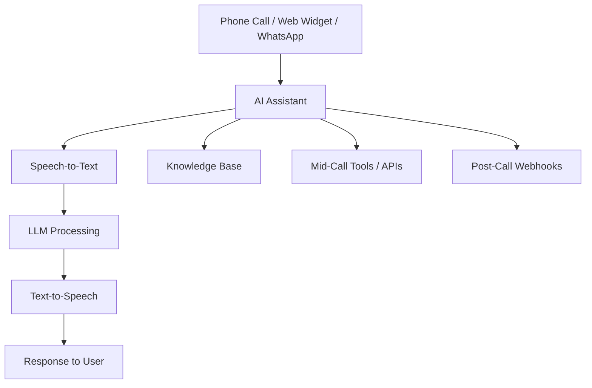

# Welcome to Aloro

Aloro is a powerful **Voice AI platform** that enables businesses to build, deploy, and manage AI-powered voice assistants. Whether you're handling inbound customer support calls, running outbound sales campaigns, or integrating WhatsApp messaging, Aloro provides the tools you need.

## What Can You Build?

With Aloro, you can create AI assistants that:

- **Handle inbound calls** - Answer customer questions, book appointments, route calls
- **Run outbound campaigns** - Reach leads at scale with personalized conversations
- **Manage WhatsApp messaging** - Automated responses and template-based outreach
- **Integrate with your systems** - Connect to CRMs, calendars, and custom APIs

## Key Features

| Feature | Description |
|---------|-------------|
| **AI Assistants** | Configure voice agents with custom prompts, voices, and tools |
| **Campaigns** | Automate outbound calling with scheduling and retry logic |
| **Knowledge Bases** | Give your assistants access to your documentation |
| **Web Widget** | Embed voice and chat on your website |
| **WhatsApp Integration** | Business messaging with AI-powered responses |
| **Custom Dashboards** | Build analytics with drag-and-drop widgets |
| **Webhooks** | Connect call data to your external systems |

## Who Is This For?

- **Sales Teams** - Qualify leads and book appointments automatically
- **Customer Support** - Handle inquiries 24/7 with AI assistants
- **Debt Collection** - Automated reminder calls and payment processing
- **Healthcare** - Appointment scheduling and patient follow-ups
- **Real Estate** - Lead qualification and property inquiries

## Getting Started

Ready to build your first AI assistant? Head over to the [Quick Start Guide](/docs/getting-started/quickstart) to get up and running in minutes.

:::tip Need Help?
If you have questions, reach out to our support team or check the [Glossary](/docs/glossary) for key terms and concepts.
:::

## Platform Architecture

The Aloro platform handles the entire voice AI pipeline, from speech recognition to natural language understanding to speech synthesis, all configurable through an intuitive dashboard.
